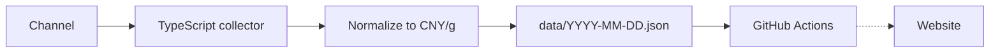

# Golden Price

Collect gold prices from multiple channels and normalize to CNY/g.

## How it works



JSON files are git-tracked. When the market is closed, slots are `null` or filled with the nearest previous price.

## Channels

| ID              | Source                                                 | Quote field                                        | Unit    |
|-----------------|--------------------------------------------------------|----------------------------------------------------|---------|
| `jingjinjin.cn` | [jingjinjin.cn](https://jingjinjin.cn/) STOMP WebSocket | `originhuangjin.prices.originhuangjin.huigou`      | CNY/g   |

```bash
pnpm install
pnpm fetch
```

```json
{
  "channel": "jingjinjin.cn",
  "cnyPerGram": 877.9,
  "unit": "CNY/g",
  "trade": true
}
```

## Data format

`data/YYYY-MM-DD.json` — 24 h × 6 slots (every 10 min), each cell is `number` or `null`.

```json
{
  "date": "2026-07-29",
  "unit": "CNY/g",
  "prices": [
    [null, null, null, null, null, null],
    [601.2, 601.3, 601.1, 601.4, 601.5, 601.2]
  ]
}
```

`prices[h][i]` — hour `h` (0–23), slot `i` (0–5). Always 24 rows × 6 cells.

## Stack

- **TypeScript** — collectors
- **GitHub Actions** — scheduled collection (~10 min)
- **JSON** — daily grids in git

## Roadmap

- [x] Channel SDK + `jingjinjin.cn` collector
- [x] Daily JSON persistence
- [ ] Scheduled runs via GitHub Actions
- [ ] Market-closed handling
- [ ] Subscriptions / alerts
- [ ] Website
