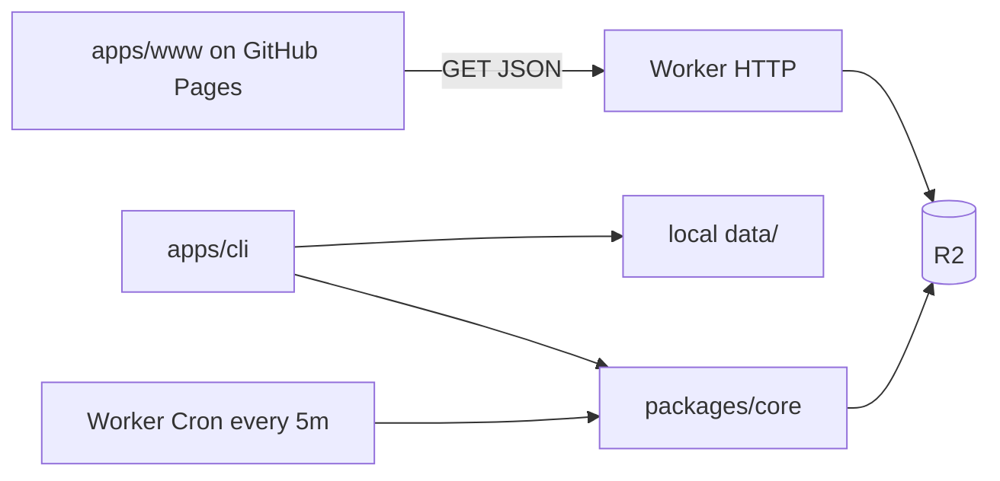

# Golden Price

Collect gold prices from multiple channels, store them as daily JSON grids, and visualize them on a static website.

## Monorepo layout

```text
apps/
  cli/                # Local CLI for one-off collection / quotes
  www/                # Astro static site with intraday charts
  worker/             # Cloudflare Worker: cron collect + R2 + data API
packages/
  core/               # Channels, storage interfaces, collection logic
data/                 # Local / sample daily price files (not production)
```



## Data format

`{channel}/YYYY-MM-DD.json` — 24 h × 12 slots (every 5 min), each cell is `number` or `null`.

```json
{
  "date": "2026-07-29",
  "unit": "CNY/g",
  "prices": [
    [null, null, null, null, null, null],
    [601.2, 601.3, 601.1, 601.4, 601.5, 601.2]
  ]
}
```

`prices[h][i]` — hour `h` (0–23), slot `i` (0–11). Slot indexes use Asia/Shanghai wall time.

Production objects live in Cloudflare R2 (`golden-price-data`), served by the Worker at `/data/...`. The repo `data/` tree is for local development and one-time migration.

## Channels

| ID              | Source                                                 | Quote field                                   | Unit  |
|-----------------|--------------------------------------------------------|-----------------------------------------------|-------|
| `jingjinjin.cn` | [jingjinjin.cn](https://jingjinjin.cn/) STOMP WebSocket | `originhuangjin.prices.originhuangjin.huigou` | CNY/g |

## Development

```bash
pnpm install
pnpm test
pnpm typecheck
pnpm cli:dev       # one-off live quote
pnpm cli:fetch     # same as cli:dev
pnpm cli:collect   # write current slot to local data/
pnpm cli:build     # typecheck the CLI
pnpm www:dev       # local website with copied data/
pnpm www:build     # production static build
pnpm worker:dev    # local Worker + R2 preview bucket
pnpm worker:deploy # deploy Worker + cron
pnpm worker:migrate # upload local data/ to remote R2 (one-time)
```

## Cloudflare Worker

1. Log in: `pnpm --filter @golden-price/worker exec wrangler login`
2. Create the R2 bucket if needed (first deploy may prompt), binding `GOLDEN_PRICE_DATA` → `golden-price-data`
3. Deploy: `pnpm worker:deploy`
4. Migrate existing local files (optional): `pnpm worker:migrate`
5. Note the Worker URL (e.g. `https://golden-price.<account>.workers.dev`)

Cron runs every 5 minutes (`*/5 * * * *`), writes the current Shanghai slot into R2, and refreshes `manifest.json`.

HTTP:

- `GET /data/manifest.json`
- `GET /data/:channel/:date.json`
- CORS allows `https://yuler.github.io` and local Astro (`http://localhost:4321`)

## Website

The Astro app in `apps/www` loads data at runtime:

- Locally (no `PUBLIC_DATA_BASE_URL`): copies `data/` into `public/data/` at build/dev time
- Production: set repo Actions variable `PUBLIC_DATA_BASE_URL` to the Worker origin (trailing slash optional). The dashboard fetches the Worker data API.

GitHub Actions deploys the site to GitHub Pages at `/golden-price/` on pushes to `main`.

## Stack

- **pnpm workspace** — monorepo
- **TypeScript** — CLI, Worker, and shared library
- **Astro** — static site
- **React + Liveline** — responsive client-side intraday market chart
- **Cloudflare Worker + R2** — scheduled collection and data API
- **GitHub Pages** — website hosting
