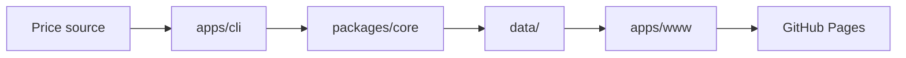

# Golden Price

Collect gold prices from multiple channels, store them as daily JSON grids, and visualize them on a static website.

## Monorepo layout

```text
apps/
  cli/                # CLI entry for scheduled and local collection
  www/                # Astro static site with intraday charts
packages/
  core/               # Channels, storage, and collection logic
data/                 # Git-tracked daily price files
```



## Data format

`data/<channel>/YYYY-MM-DD.json` — 24 h × 12 slots (every 5 min), each cell is `number` or `null`.

```json
{
  "date": "2026-07-29",
  "unit": "CNY/g",
  "prices": [
    [null, null, null, null, null, null],
    [601.2, 601.3, 601.1, 601.4, 601.5, 601.2]
  ]
}
```

`prices[h][i]` — hour `h` (0–23), slot `i` (0–11). Slot indexes use Asia/Shanghai wall time.

## Channels

| ID              | Source                                                 | Quote field                                   | Unit  |
|-----------------|--------------------------------------------------------|-----------------------------------------------|-------|
| `jingjinjin.cn` | [jingjinjin.cn](https://jingjinjin.cn/) STOMP WebSocket | `originhuangjin.prices.originhuangjin.huigou` | CNY/g |

## Development

```bash
pnpm install
pnpm test
pnpm typecheck
pnpm cli:dev       # one-off live quote
pnpm cli:fetch     # same as cli:dev
pnpm cli:collect   # write current slot to data/
pnpm cli:build     # typecheck the CLI
pnpm www:dev       # local website with copied data/
pnpm www:build     # production static build
```

## Website

The Astro app in `apps/www` copies `data/` into `public/data/` at build time and serves:

- the latest available single-channel gold quote
- today's absolute and percentage change when at least two quotes exist
- a responsive Liveline intraday chart with pointer and touch scrubbing
- honest empty, sparse, stale, loading, and error states

GitHub Actions deploys the site to GitHub Pages at `/golden-price/` when `main` changes or after a successful Data Collect run.

## Stack

- **pnpm workspace** — monorepo
- **TypeScript** — CLI and shared library
- **Astro** — static site
- **React + Liveline** — responsive client-side intraday market chart
- **GitHub Actions** — scheduled collection and Pages deploy
